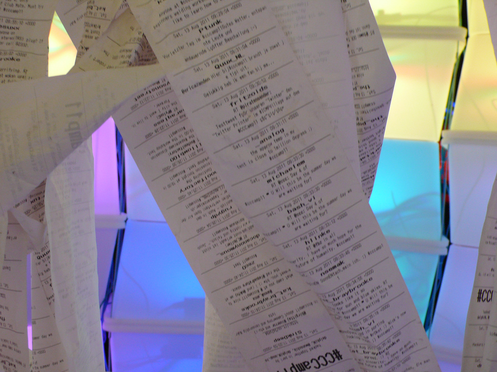

## The First Prototype ##

In 2007 I was an active member at a [hackerspace](http://k4cg.org/) located in Nuremberg, Germany. Around this time I had the idea to reuse an old thermal-printer from ebay to printout news from an RSS feed. The first idea was to print important system messages and status updates but after drinking some of the good dark German Kellerbier I must have decided to take a more artistic approach with this:

I wanted to print snippets of digital human communication and pass this printout on to a small shredder that destroys the recently printed messages. This would visualize the **transience** of our **fast** and sometimes **meaningless** way to communicate in these days.

I wanted the installation to be "plug and play" and something you could easily carry around. So I decided to implement a Linux application and run it on an "embedded" device. Because the **Raspberry Pi** was still in early development at this time and years away from the market I bought an uATX Atom board and installed Ubuntu.
Not long after starting I realized that there was only a Windows driver for my printer, so I started [porting](https://github.com/mojoaxel/twinter) a free Java example application into Perl. After that I now was ready to print text and lines with basic formatting.  

With the help of some colleagues at the hackerspace I even [got the line printer driver from Linux to work](http://k4cg.org/k4cg:projekte:rss-drucker) and we could start printing. At this time twitter still had a free RSS-feed API so I started printing out Tweets with specific tags.
I had some problems with my Perl scripts and the printer's cutter and so I decided to not connect a shredder and instead print long ribbons of tweets to create a curtain to walk through:

Despite the problems, I was part of an "art & beauty" exhibition at the [Chaos-Communication-Camp 2007](http://events.ccc.de/camp/2007/Intro/).

### Links ###

* [The perl prototype from 2007](../project_code/V1/)
* [How to set up the printer](http://k4cg.org/k4cg:projekte:rss-drucker) on Ubuntu
