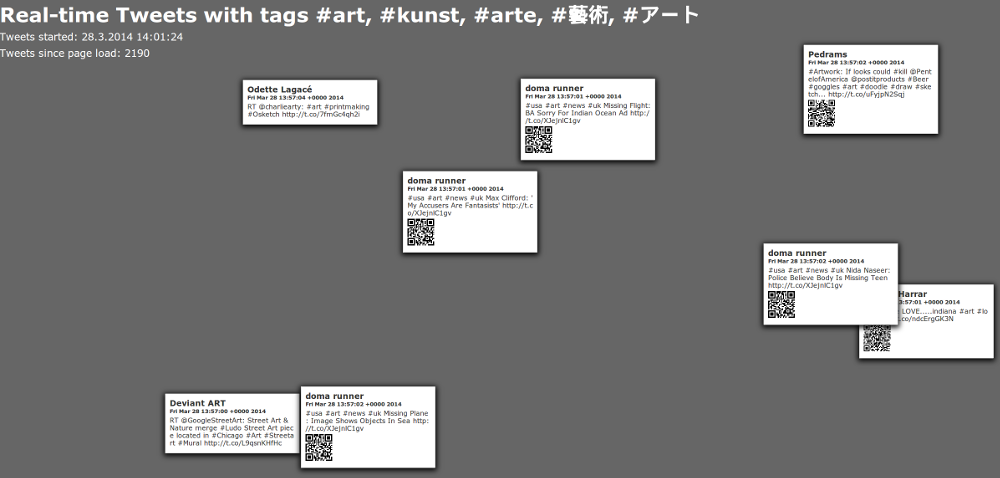

## The Software ##

My first prototype just periodically loaded an RSS Feed from Twitter and printed the results. 
To get a "real time" experience Twitter's streaming API has to be used.
The idea is to receive all tweets with a given hashtag and pass them forward to the different printers in the system.

I implemented a prototypical application and an example client in node.js.
The idea was to separate the tweet-collector (backend) from the tweet-printer (client) parts, so that the backend could run on a fast connected server while the printer modules could be connected e.g. with a slow mobile connection.

### The Backend ###

The backend uses the twitter streaming API (maybe later also app.net and others) to receive updated tweets with given hashtags (here #art, #kunst, #arte, and so on). These news-items are passed on to the connected printers over a socket.io connection.
At the moment there are no queues implemented so that only one client should connect, but this is not a hard thing to do and should be done after multiple printers have connected to the system.

[backend source](../project_code/V2/backend)

### The client ###

Because I have no suitable printer at the moment (should arrive in a few days) I wrote a simple tweet-wall application to print/show the live tweets in the browser.

[client source][Backend Source](../project_code/V2/client)

## Demo ##

The example app is running on a vserver from digitalocean and can be accessed here:

[DEMO](http://95.85.40.145:9100/)

