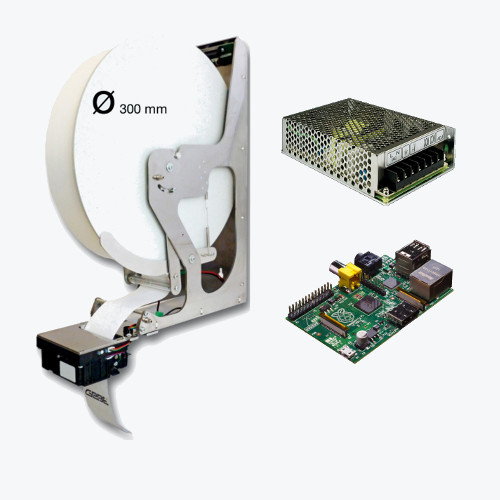

## The Hardware ##

To print large amounts of tweets, multiple printers have to be running nearly non-stop for the whole exhibition. 
To print all Tweets with, for example, the hash-tag **#art** for one random hour, about 3 printers with normal paper-rolls (50 metres)have to run simultaneously and their paper-rolls would be almost gone at the end of that one hour.
Also, in my experience the cutter could be a problem. So I started to look for different consumer printers and bought a range of old models on eBay. Sadly none of the printers I bought could be easily programmed or did not perform as well as I would have liked.

To run such an installation for a whole day during a exhibition, fast and industry-proven professional printers must be used. 
Cheap and popular printers like the [Littleprinter](https://twitter.com/search?q=%23art&src=typd&f=realtime) or [Adafruits DIY-Printer](https://www.adafruit.com/products/597) usually do not have any auto-cutter at all and do not provide the speed and quality necessary for this project.

During the last years I sometimes found myself surreptitiously inspecting the printers at cash-registers. Now I finally found a promising model at the [embedded world fair](http://www.embedded-world.de/de/rueckblick/) in February this year and finally decided to realize the project.

After talking about my ideas with one of the Business-Engineers at [GEBE Elektronik und Feinwertechnik GmbH](http://oem-printer.com/) they offered to provide me with the needed 5 to 10 printers for an exhibition. 
The [choosen printer](http://www.oem-printer.com/catalog/BCC39CC007fca319CFXpYYD68CE3/page2615.html) comes with a Linux driver and USB connection which is perfect, as it allows me to control it with the Rasberry Pi.
A [power-suppy with 5V and 24V](https://secure.reichelt.de/SNT-MW60-DB/3/index.html?&ACTION=3&LA=446&ARTICLE=66863&artnr=SNT+MW60-DB&SEARCH=24v+netzteil) output was luckily much easier to find than the printer.

  