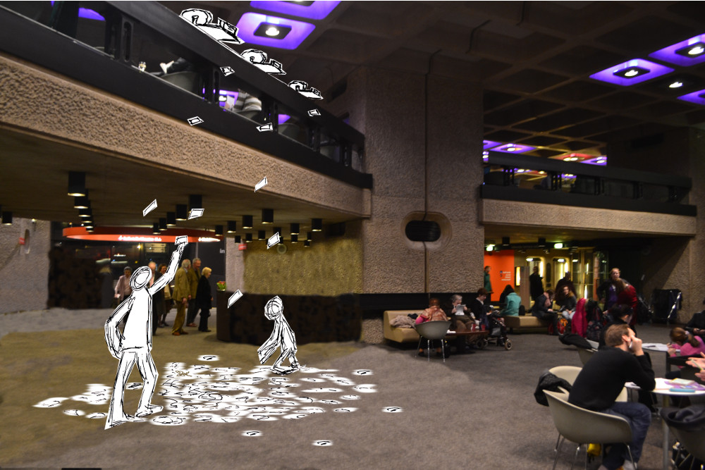

# schneeiger_bote

"schneeige bote" is artificial German and means something like "the snow-like one who brings the news".

## Authors

- Alexander Wunschik - [mojoaxel](https://github.com/mojoaxel "GitHub Account")

## Description

News are unique like snow-flakes in there content, the sender and the time they were posted. I want to create a installation that prints real-time "tweet-flakes" from all over the world on small thermo-paper snippets and let them "rain" down on the visitors. 
The small and lightweight printouts "live" only a few seconds while the fly through the air before the are walked upon and forgotten. I want the visitors to realize that these *transience* and *worthlessness* mass of *creaking* tweets under there shoes can also be picked up again, read, kept of thrown away. By combining a real-time node.js-backend with a lightweight RaspberryPi module with an attached kiosk printer I want to show an alternative and haptic way to experience some random tweets of the world.



## Link to Prototype

The [first prototype](project_posts/2014-03-24-The-First-Prototype.md) was shown as part of the "art & beauty" exhibition at the Chaos-Communication-Camp 2007. There long ribbon with the conference hashtag were created an hang up to create a curtain to walk through:


## Example Code

Here are some snippets of the old perl prototype (2007):

```perl
$tcp2k->set_text_size(3);
$tcp2k->set_style( $STYLE_BOLD );
$tcp2k->print_text( $hash );	

$tcp2k->set_text_size(0);
$tcp2k->set_char_width(0);
$tcp2k->set_style( $STYLE_NONE );
$tcp2k->print_text( "hacked together in perl by" );
$tcp2k->set_style( $STYLE_BOLD );
$tcp2k->print_text( 'mojoaxel, @wunschik, http://delphiN.soup.io' ); 
```
